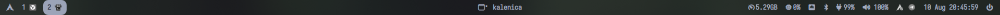
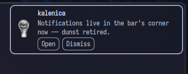
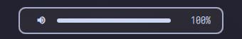
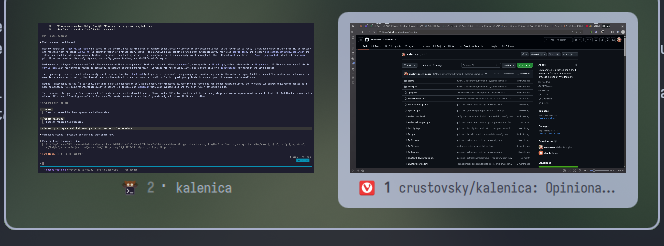

# kalenica

*Polish: the ridge of a roof — the topmost horizontal line.*

An opinionated [Quickshell](https://quickshell.org) bar and shell essentials
for [Hyprland](https://hypr.land). One process that replaced waybar, dunst,
swayosd, grimblast and a window switcher on my desktop.



## Philosophy

A bar should do what a bar is supposed to do — show state, take the obvious
click — and nothing else. No plugin system, no widget marketplace, no drift
toward a desktop environment. Every feature here exists because a separate
daemon used to provide it and folding it into the shell made the desktop
simpler: fewer packages, fewer processes, one theme, one config.

It is opinionated and deliberately so: my machine is the reference. The
layout, animations and interaction patterns are decisions, not options.
What *is* configurable lives in one small `config.json` (colors, font,
timings, thresholds, click commands) and applies live on save.

## What's in the box

- **Bar** — workspaces with app icons (every monitor shows all workspaces;
  drag an icon onto any pill to silently move the window there, right-click
  a foreign pill to pull that workspace over), active window title, mpris
  media, monochrome tray, CPU / memory / network / bluetooth / battery /
  audio / backlight modules with hover tooltips, clock with calendar popup
  (ISO weeks, scroll to flip months), power menu with confirm dialogs.
- **Popups** — audio output/input switcher, wifi network list (native
  connect, password prompt for new secured networks, right-click the icon
  for radio off), bluetooth devices incl. scan/pair mode.
- **Notifications** — a full `org.freedesktop.Notifications` daemon:
  cards with icons and action buttons, critical urgency never auto-expires.

  
- **OSD** — volume, microphone, screen and keyboard backlight.

  
- **Screenshots** — full screen, active window, or drag-select area with a
  post-drag adjust mode (resize/move the region, arrow-key nudge, x/y/w/h
  readout) — saved dated to disk, copied to the clipboard, notified.
- **Expo** — alt-tab-style window switcher with live `ScreencopyView`
  previews, MRU order, keyboard and mouse.

  

Deliberately **not** in the box: a launcher, a lock screen, wallpaper
handling. Those stay external (the launcher button and lock button run
whatever commands you configure).

## Requirements

- **Quickshell** ≥ 0.3.0
- **Hyprland** 0.55+ configured with the **native Lua config**. This is a
  hard assumption: workspace drag-to-move, workspace pulling and Expo's
  focus dispatch send Lua dispatcher expressions (`hl.dsp.*`) over IPC,
  which a classic `hyprland.conf` setup will not evaluate.
- A **Nerd Font** (the default config uses Iosevka Nerd Font) for the bar
  glyphs.
- CLI tools: `wpctl` (WirePlumber) for audio, `brightnessctl` for internal
  backlights, `ddcutil` for external-monitor brightness over DDC/CI,
  `wl-copy` for screenshot clipboard, `notify-send` (libnotify).
- System services: NetworkManager, UPower, BlueZ — all consumed over D-Bus.

## Install

```sh
git clone https://github.com/crustovsky/kalenica ~/.config/quickshell
```

Run it with `qs`, or as a systemd user service bound to the session
(recommended under uwsm — see [`examples/quickshell.service`](examples/quickshell.service)):

```sh
systemctl --user enable --now quickshell.service
```

Hyprland integration — the blur layer rule and the keybinds that drive the
IPC entry points — is in [`examples/hyprland.lua`](examples/hyprland.lua).

On first run a `config.json` with the defaults below is created next to
`shell.qml`. Edits apply live; no reload needed.

## Configuration

| Key | Default | |
| --- | --- | --- |
| `theme.colors.*` | catppuccin-ish palette | ten base hexes: background, foreground, hoverForeground, urgent, warning, critical, notification bg/fg/border/borderCritical |
| `theme.barAlpha` | `0.7` | bar translucency (calibrated against blur, see examples) |
| `theme.notificationAlpha` | `0.5` | card translucency |
| `theme.font.family` / `.size` | `Iosevka Nerd Font` / `14` | |
| `timing.hoverFade` | `120` | ms, hover highlight fade |
| `timing.popupGrow` | `200` | ms, popup scale-in |
| `timing.drawerSlide` | `300` | ms, drawer expand |
| `timing.tooltipDelay` | `150` | ms before tooltips show |
| `timing.popupHoverClose` | `1500` | ms of hover-away before popups close |
| `modules.clock.format` | `dd MMM HH:mm:ss` | |
| `modules.battery.low` / `.critical` | `20` / `10` | %, pulse / persistent alert |
| `modules.notifications.timeout` | `5000` | ms, non-critical cards |
| `modules.osd.hideDelay` | `1500` | ms |
| `modules.screenshot.directory` | `~/Pictures` | |
| `modules.launcher.command` | `["vicinae", "toggle"]` | launcher button |
| `modules.power.lockCommand` | `["uwsm", "app", "--", "hyprlock"]` | lock button |
| `modules.cpu.clickCommand` | `["resources"]` | CPU module click |
| `modules.memory.clickCommand` | `["kitty", "--class", "btop", "btop"]` | memory module click |
| `modules.audio.rightClickCommand` | `["kitty", "--class", "Cava", "cava"]` | volume module right-click |

Animation shapes, layout and geometry are not configurable on purpose.

## IPC

Everything interactive that a keybind should reach goes through `qs ipc`:

| Call | Does |
| --- | --- |
| `qs ipc call bar toggle` | hide/show the bar |
| `qs ipc call brightness raise` / `lower` | screen brightness + OSD |
| `qs ipc call osd kbdlight` | keyboard backlight OSD |
| `qs ipc call screenshot screen` / `active` / `area` | screenshots |
| `qs ipc call expo toggle` | window switcher |

## Structure

Flat directory, one QML file per bar module; `shell.qml` → `Bar.qml` →
modules. Shared pieces exist only where a third copy forced them
(`BarItem`, `Drawer`, `AnchoredPopup`, `Theme`, …). If you read one file
you've seen the idiom of all of them.

## Contributing

Bug fixes are always welcome. Functionality is welcome when it fits the
scope above — something a bar/shell legitimately owns, ideally replacing an
external daemon rather than adding one. Feature requests that grow this
toward a desktop environment will be declined kindly.

## License

[MIT](LICENSE)
